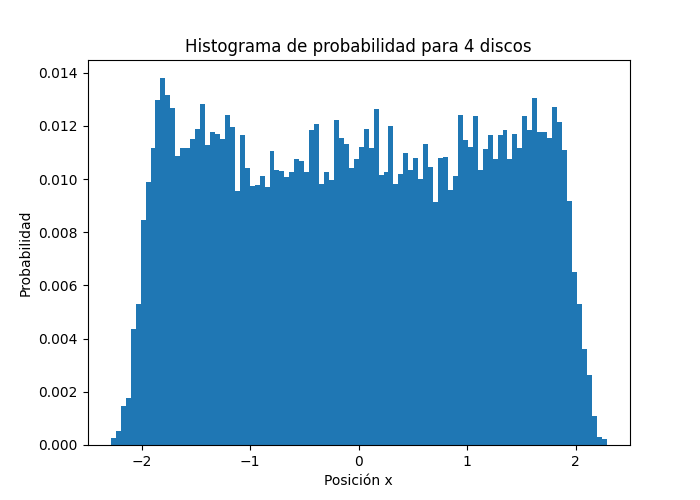
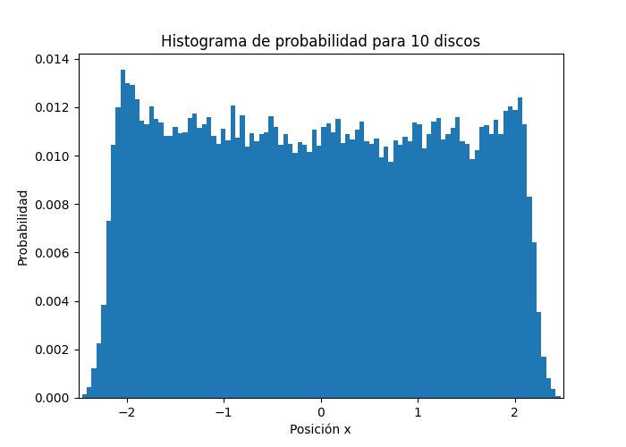
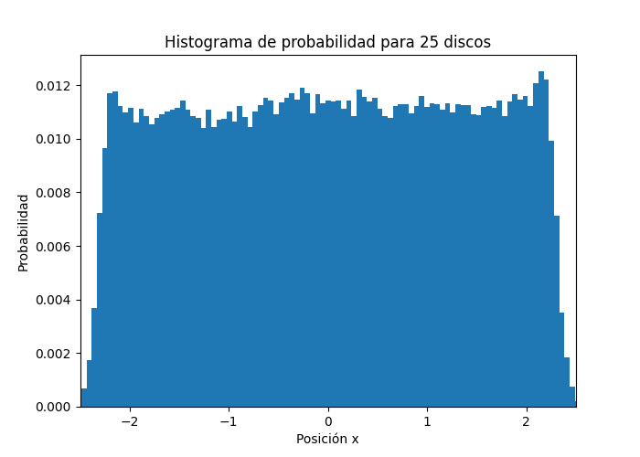

# Referencias y ejemplos de ejecución 

## Clase principal: Disco

::: Discos.Disco

## Clase de simulación: DiscoSimulation

::: Discos.DiscoSimulation

# Ejemplo animación:

.gif)
.gif)

## Predicción de sucesos
::: Discos.time_to_disk_collision
::: Discos.determine_collision_event

## Histograma

::: Discos.save_data

::: Discos.run_and_save_data

::: Discos.Histogram

# Ejemplos de histogramas: 

