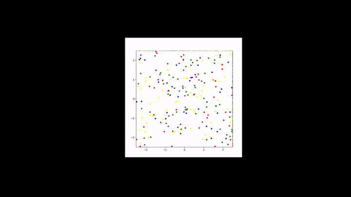

# Referencias y ejemplos de ejecución 

## Clase principal: Disco

::: Discos.Disco

## Clase de simulación: DiscoSimulation

::: Discos.DiscoSimulation

# Ejemplo animación:

.gif)
.gif)

## Predicción de sucesos
::: Discos.time\_to\_disk\_collision
::: Discos.determine\_collision\_event

## Histograma

::: mk\_csv.save\_data

::: mk\_csv.run\_and\_save\_data

::: mk\_hisotgram.Histogram
